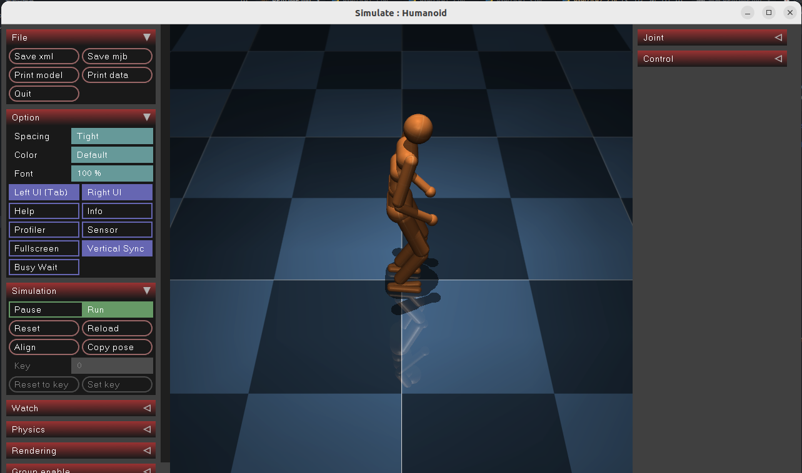
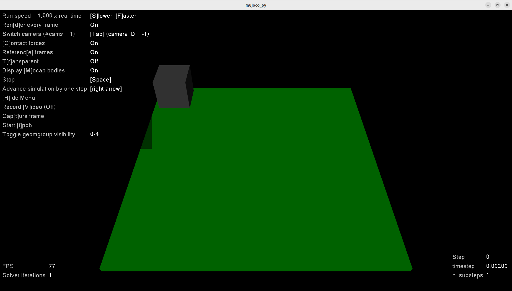

# Set up

## Setup environment
```bash
conda create -n spinningup python=3.6
conda activate spinningup
sudo apt-get update && sudo apt-get install libopenmpi-dev
git clone https://github.com/openai/spinningup.git
cd spinningup
```
comment the line 'mpi4py' in setup.py
```bash
conda install mpi4py
pip install -e .
```

## Check set up correctly
```bash
python -m spinup.run ppo --hid "[32,32]" --env LunarLander-v2 --exp_name installtest --gamma 0.999
python -m spinup.run test_policy data/installtest/installtest_s0
python -m spinup.run plot data/installtest/installtest_s0
```
If successful, the above three commands should run correctly.


# Install MuJoCo
> reference tutorial: https://zhuanlan.zhihu.com/p/535806578, https://zhuanlan.zhihu.com/p/472290066

Visit https://www.roboti.us/license.html and click the `Activation key` to get `mjkey.txt`
```bash
wget https://mujoco.org/download/mujoco210-linux-x86_64.tar.gz
mkdir ~/.mujoco
tar -xvzf mujoco210-linux-x86_64.tar.gz -C ~/.mujoco
cp mjkey.txt ~/.mujoco
cp mjkey.txt ~/.mujoco/mujoco210/bin
gedit ~/.bashrc
```

put the flowwing lines into `~/.bashrc`, and save the file
```bash
export LD_LIBRARY_PATH=~/.mujoco/mujoco210/bin${LD_LIBRARY_PATH:+:${LD_LIBRARY_PATH}}
export MUJOCO_KEY_PATH=~/.mujoco${MUJOCO_KEY_PATH}
export LD_LIBRARY_PATH=$LD_LIBRARY_PATH:/usr/lib/nvidia
export PATH="$LD_LIBRARY_PATH:$PATH"
export LD_PRELOAD=/usr/lib/x86_64-linux-gnu/libGLEW.so
```
After closed the file, run
```bash
source ~/.bashrc
cd ~/.mujoco/mujoco210/bin
./simulate ../model/humanoid.xml
```
If install successfully, it will appear the following window


## Install mujoco-py

https://github.com/openai/mujoco-py

```bash
conda activate spinningup
sudo apt purge --autoremove libcifpp-data libcifpp2 dssp
sudo apt -f install
sudo apt autoremove
sudo apt update
sudo apt-get install patchelf
sudo apt-get install python3-dev build-essential libssl-dev libffi-dev libxml2-dev
sudo apt-get install libxslt1-dev zlib1g-dev libglew-dev python3-pip

sudo apt install git
cd ~/.mujoco
git clone https://github.com/openai/mujoco-py
cd mujoco-py
pip install -r requirements.txt
pip install -r requirements.dev.txt
pip3 install -e . --no-cache
```

After rebooting the computer, run
```bash
conda activate spinningup
sudo apt install libosmesa6-dev libgl1-mesa-glx libglfw3
sudo ln -s /usr/lib/x86_64-linux-gnu/libGL.so.1 /usr/lib/x86_64-linux-gnu/libGL.so
pip3 install -U 'mujoco-py<2.2,>=2.1'
pip install Cython==3.0.0a10
cd ~/.mujoco/mujoco-py/examples
python3 setting_state.py
```
If install successfully, it will appear the following window



## Install gym for spinningup's mujoco

```bash
cd spinningup
conda activate spinningup
pip install gym[all] --no-deps mujoco_py
python -m spinup.run ppo --hid "[32,32]" --env Walker2d-v2 --exp_name mujocotest
python -m spinup.run test_policy data/mujocotest/mujocotest_s0
```
If install successfully, it will appear the following window


# Spinningup exercises
```bash
conda activate spinningup
cd spinningup
# exercise1-1
python -m spinup.exercises.pytorch.problem_set_1.exercise1_1

# exercise1-2
python -m spinup.exercises.pytorch.problem_set_1.exercise1_2

# exercise1-3
python -m spinup.exercises.pytorch.problem_set_1.exercise1_3
python -m spinup.exercises.pytorch.problem_set_1.exercise1_3 --env HalfCheetah-v2    --use_soln
python -m spinup.run plot data/ex13-td3-halfcheetah-v2/ex13-td3-halfcheetah-v2_s0


python -m spinup.exercises.pytorch.problem_set_1.exercise1_3 --env InvertedPendulum-v2  --use_soln
python -m spinup.run plot data/ex13-td3-invertedpendulum-v2/ex13-td3-invertedpendulum-v2_s0


# exercise2-1
python -m spinup.run trpo --env Hopper-v2 --train_v_iters[v] 0 80 --exp_name ex2-1 --epochs 250 --steps_per_epoch 4000 --seed 0 10 20 --dt
python -m spinup.run plot data/2025-05-31_ex2-1_v80/2025-05-31_17-20-29-ex2-1_v80_s20
python -m spinup.run plot data/2025-05-31_ex2-1_v80/2025-05-31_17-13-36-ex2-1_v80_s10
python -m spinup.run plot data/2025-05-31_ex2-1_v80/2025-05-31_17-06-44-ex2-1_v80_s0
python -m spinup.run plot data/2025-05-31_ex2-1_v0/2025-05-31_17-17-12-ex2-1_v0_s20
python -m spinup.run plot data/2025-05-31_ex2-1_v0/2025-05-31_17-10-21-ex2-1_v0_s10
python -m spinup.run plot data/2025-05-31_ex2-1_v0/2025-05-31_17-03-26-ex2-1_v0_s0
python -m spinup.run plot data/2025-05-31_ex2-1*
python -m spinup.run test_policy data/2025-05-31_ex2-1_v80/2025-05-31_17-20-29-ex2-1_v80_s20

# exercise2-2
python -m spinup.exercises.pytorch.problem_set_2.exercise2_2
python -m spinup.run plot data/2025-05-31_ex2-2_ddpg_halfcheetah-v2/2025-05-31_23-04-48-ex2-2_ddpg_halfcheetah-v2_s0
python -m spinup.run plot data/2025-05-31_ex2-2_ddpg_halfcheetah-v2/2025-05-31_23-06-18-ex2-2_ddpg_halfcheetah-v2_s10
python -m spinup.run plot data/2025-05-31_ex2-2_ddpg_halfcheetah-v2/2025-05-31_23-07-47-ex2-2_ddpg_halfcheetah-v2_s20
python -m spinup.run plot data/2025-05-31_ex2-2_ddpg_halfcheetah-v2_bug/2025-05-31_23-05-33-ex2-2_ddpg_halfcheetah-v2_bug_s0
python -m spinup.run plot data/2025-05-31_ex2-2_ddpg_halfcheetah-v2_bug/2025-05-31_23-07-02-ex2-2_ddpg_halfcheetah-v2_bug_s10
python -m spinup.run plot data/2025-05-31_ex2-2_ddpg_halfcheetah-v2_bug/2025-05-31_23-08-31-ex2-2_ddpg_halfcheetah-v2_bug_s20
python -m spinup.run plot data/2025-05-31_ex2-2*

# bonus: batchsize=1
python -m spinup.run plot data/2025-06-01_ex2-2*
```

